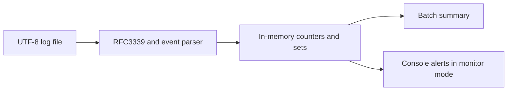

# Security Log Sentinel

A Rust command-line learning project for parsing authentication logs, summarizing
failed logins and printing heuristic alerts while a file grows.

## Data flow



The implementation uses Rust, Clap for the CLI and Chrono for timestamps.
It reads local files; it does not connect to identity providers or collect
operating-system logs automatically.

## Build and run

Requires a Rust toolchain supporting edition 2024 (Rust 1.85 or later).

```bash
cargo build --locked
cargo test --locked
cargo run --locked -- analyze sample_logs.txt
```

The supplied sample contains **8 events: 2 successful and 6 failed logins**.
Malformed nonblank lines are reported and skipped. Unknown event types are
counted as other events.

The repository currently has no automated Rust test cases; a successful
`cargo test` invocation verifies compilation but does not establish detection
coverage.

## Log format

```text
2026-09-29T10:00:00Z WARN LOGIN_FAIL user=alice ip=192.0.2.10
2026-09-29T10:00:01Z INFO LOGIN_SUCCESS user=alice ip=192.0.2.10
```

The first three whitespace-separated fields are an RFC3339 timestamp, level
and event type. Recognized events are `LOGIN_SUCCESS` and `LOGIN_FAIL`.
Optional `user=` and `ip=` fields drive aggregation; other key/value fields
are ignored. This format is not a general syslog or JSON parser.

## Monitor mode

The file must already exist. Monitoring starts at its current end, so only
newly appended lines are analyzed:

```bash
cargo run --locked -- monitor live_logs.txt
```

Append complete newline-terminated records from a second terminal. For example
in PowerShell:

```powershell
Add-Content live_logs.txt '2026-09-29T10:00:00Z WARN LOGIN_FAIL user=alice ip=192.0.2.10'
```

Polling occurs every 500 ms. Stop with Ctrl+C.

## What the thresholds mean

| Mode | Signal | Threshold |
| --- | --- | --- |
| Analyze | Failed logins per user or IP | At least 3 across the whole file |
| Monitor | Repeated failures from one IP | At least 5 within 30 seconds of event timestamps |
| Monitor | One IP targeting distinct users | At least 5 users across the monitoring session |
| Monitor | One user targeted from distinct IPs | At least 5 IPs across the monitoring session |

The last signal is currently labelled “Possible ACCOUNT TAKEOVER” in console
output. It is based on failed attempts and **does not prove a successful account
compromise**. Password-spraying and multi-IP sets have no sliding time window.

## Verification and limitations

Review on 29 September 2026: build completed with Rust 1.90, the sample summary
matched its eight records, and a synthetic append exercise triggered the
five-failures-in-30-seconds alert. These are smoke checks, not a security
effectiveness evaluation.

- Event timestamps should arrive in chronological order for the rolling queue.
- Thresholds are hardcoded and repeated matching events can repeat alerts.
- Missing user/IP values are grouped together.
- State grows for the lifetime of the process; there is no persistence or
  bounded retention policy.
- Truncation is detected by file size. Same-size/larger file replacement and
  partial-line writes are not handled robustly.
- There is no alert forwarding, dashboard, automated blocking or SIEM integration.
- Authentication logs can contain personal data; use synthetic examples for
  public demonstrations.

## Source layout

`src/main.rs` contains the parser, counters, CLI and both execution modes.
`sample_logs.txt` is the batch fixture; `live_logs.txt` is a monitoring sample.
`Cargo.lock` fixes dependency resolution for reproducible builds.
